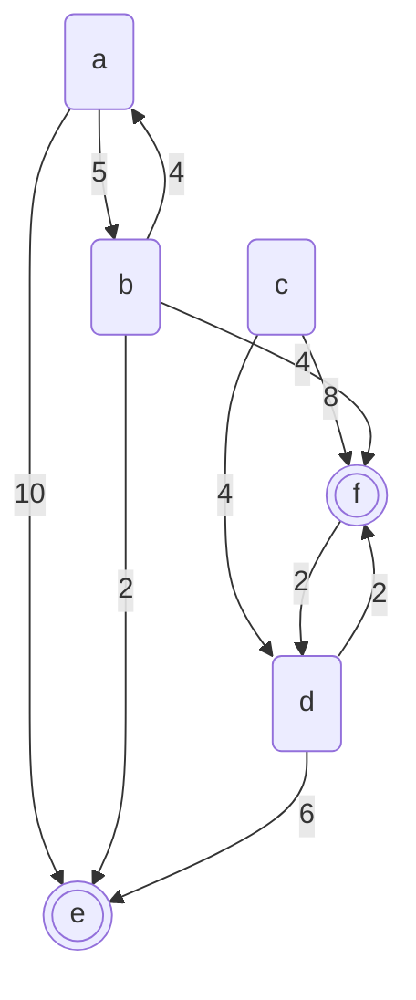

# _{{ page.title }}_

# About this module

-   Prerequisites:

-   Objectives: This module explores the concept of graphs and graph
    related algorithms.

# What is a graph?

A graph is a 2-tuple, $G=(V,E)$, where $V$ is a set of vertices, and $E$
is a set of edges. There is little restriction of the set of vertices.
However, the nature of the set of edges depends on whether a graph is
directed or not.

In the case of a directed graph, or a digraph in short,
$E\subseteq V \times V$. This means that each edge is a two-tuple where
the first item (called the tail) and the second item (called the head)
are both elements of $V$. Recall that ordering is significant in a
tuple. An edge of a digraph is usually drawn as an arrow going from the
tail (first item) to the head (second item).

A graph may be un-directed. Such a graph can be seen as a special case
of a digraph where $(a,b)\in E \Leftrightarrow (b,a) \in E$.

# Terms

A path $p$ in a graph $G=(V,E)$ is a tuple of vertices. Edges from $E$
must lead from one vertex to the next. In other words,

$\forall i \in \mathbb{N}(i \le |p|-2 \Rightarrow (p[i],p[i+1]) \in E)$

Furthermore, a path cannot contain duplicates of a vertex.

In many graphs, a distance function $d:E \rightarrow \mathbb{R}^*$ maps
edges of a graph to real number values. In most cases, the distance of
an edge cannot be negative, hence the use of $\mathbb{R}^*$ to denote
non-negative real numbers.

# Dijkstra's algorithm

Dijkstra's algorithm finds the shortest path from all vertices in a
graph to a particular set of "destination" vertices. The following is
the pseudocode:

-   let the graph be $G=(V,E)$, and $d:E \rightarrow \mathbb{R}^*$ be a
    distance function of all edges

-   let $S \subseteq V$ be a subset of vertices identified as
    destinations

-   for each $v \in S$: $L(v) \leftarrow 0$ because a destination vertex
    is at a length of 0 from a destination.

-   for each $v \in (V-S)$: $L(v) \leftarrow \infty$ because prior to
    any exploration, there is no known path between a non-destination
    vertex and a destination

-   $Q \leftarrow S$ initialize the set of "boundary" vertices that have
    a just updated length to a destination

-   $E' \leftarrow \{\}$, this is the set of solution edges

-   while $Q \neq \{\}$ do

    -   select $v \in Q$ such that $\forall w \in Q(L(v) \le L(w))$, $v$
        has the shortest length to a destination of all the boundary
        vertices, it looks the most promising

    -   $Q \leftarrow Q - \{v\}$ because we are now expanding the
        boundary using $v$

    -   for each $e \in \{(w,v)|(w,v) \in E\}$ do:

        -   assume $e = (w,v)$

        -   if $L(v)+d(e) < L(w)$ then:

            -   $L(w) \leftarrow L(v)+d(e)$

            -   for each $(w,u) \in E'$ do:
                $E' \leftarrow E' - \{(w,u)\}$ because we just found a
                shorter path from vertex $w$ to a destination

            -   $E' \leftarrow E' \cup \{(w,v)\}$ to remember the new
                edge leading from $w$ to a destination that has the
                shortest path

            -   $Q \leftarrow Q \cup \{w\}$ because vertex $w$ is
                updated, there it is (perhaps again) on the boundary of
                vertices just updated with a shortest length to a
                destination, this triggers the (re)evaluation of
                vertices connected to $w$ by edges

-   define solution graph $G' = (V, E')$

# The A\* Algorithm

The A\* (pronounced a-star) algorithm is another shortest path finding
algorithm. It differs from Dijkstra's algorithm in that the A\*
algorithm utilizes a "heuristic" function to guide the search for the
shortest path. A heuristic function for a graph $G=(V,E)$ is often in
the form of $h:(V\times V)\rightarrow
  \mathbb{R}^*$. It is a quick-to-compute function that estimates the
actual shortest distance between two vertices. Because the A\* algorithm
only has one destination $x$, the heuristic function only needs to be
$h:(V \times \{x\}) \rightarrow \mathbb{R}^*$ because there is no need
to know the heuristic between a vertex and any non-destination vertex.

In order for the A\* algorithm to function, the heuristic function has
to be admissible. This means that if
$L:(V \times V)\rightarrow \mathbb{R}^*$ represents the actual length of
the shortest path between two vertices, then
$\forall v,w\in V(h(v,w) \leq L(v,w))$. In short, the heuristic function
must be an *underestimate* of the actual length of the shortest path.

Note that one always define $h(v,w)=0$ as an underestimating heuristic.
However, this means the search for the shortest path is not any more
guided than Dijkstra's algorithm.

The A\* algorithm differs from Dijkstra's algorithm in an important way.
While Dijkstra's algorithm explores "backwards" from destination
vertices, The A\* algorithm explores "forward" from a start vertex. The
following presents the pseudocode of the A\* algorithm:

-   Let the graph in question be $G=(V,E)$

-   Let the distance function be $d:E \rightarrow \mathbb{R}^*$, this
    functions maps each edge to a non-negative real number as the
    distance

-   Let $s \in V$ be a start vertex, unlike Dijkstra's algorithm, A\*
    only works with a single start vertex.

-   Let $x \in V$ be a destination vertex, again, unlike Dijkstra's
    algorithm, A\* only works for one destination vertex. It is possible
    to create the illusion of multiple destination vertices by zero
    distance edges from real destination vertices to a single "virtual"
    destination.

-   Let $h:(V \times V) \rightarrow \mathbb{R}^*$ be a heuristic
    function where $h(v,w)$ is an underestimate of the cost of the
    shortest path from $v$ to $w$. Due to the under estimating nature,
    such a heuristic is also called "admissible".

-   for each $v \in V$ do initialize it

    -   if $v \neq s$ then

        -   $g(v) \leftarrow \infty$ explanation: $g(v)$ is the actual
            length of the shortest known path from $s$ to $v$.

        -   $f(v) \leftarrow \infty$ explanation: $f(v)$ is the
            estimation of the length of the shortest path from $s$
            *through* $v$ to $x$. In other words, $f(v)=g(v)+h(v,x)$.

    -   else

        -   $g(v) \leftarrow 0$ see comments above for what $g(v)$
            represents

        -   $f(v) \leftarrow h(s,x)$ see comments above for what $f(v)$
            represents

    -   $\mathrm{prev}(v) \leftarrow \mathrm{undefined}$, this is our
        easy way of tracking edges on the current known-to-be-shortest
        path, each vertex along this path has a reverse pointer to the
        vertex before it, back to vertex $s$.

-   Let $O \leftarrow \{s\}$, start with the start vertex, this is very
    different from Dijkstra's algorithm that starts with all the
    destination vertices. However, $O$ is still the frontier set that
    represents vertices that have recently been updated and are
    candidates to be on the shortest path from $s$ to $x$.

-   while $\exists v \in O(f(v) < g(x))$ do, this basically says "if
    there are candidates on the shortest path, let us explore them"

    -   Let $c \in O$ such that $\forall w \in O(f(c) \le f(w))$, this
        picks up the "most promising" candidates from $O$.

    -   $O \leftarrow O - \{c\}$, remove it so it is not going to be
        reconsidered endlessly.

    -   for each neighbor $n \in V$ such that $(c, n) \in E$ do

        -   $t \leftarrow g(c)+d((c,n))$ this is the actual length of
            the shortest known path from $s$ through $c$ to $n$

        -   if $t < g(n)$ then, we have found a shorter path to get to
            $n$, so $n$ should be considered as a candidate on the
            shortest path now

            -   $O \leftarrow O \cup \{n\}$

            -   $\mathrm{prev}(n) \leftarrow c$

            -   $g(n) \leftarrow t$ update length of known shortest path
                from $s$ to $n$

            -   $f(n) \leftarrow g(n)+h(n,x)$ update estimated length of
                shortest path from $s$ through $n$ to $x$

-   define $G_{s,x}=(V,E_{s,x})$ such that
    $\forall w \in V(\mathrm{prev}(w)=v \Leftrightarrow (v,w) \in E_{s,x})$,
    this is an alternative way to create the solution graph. The good
    thing about this approach is that there is no need to erase edges
    along the way like the Dijkstra's algorithm. The two methods are
    actually equivalent.

# Graph Examples

