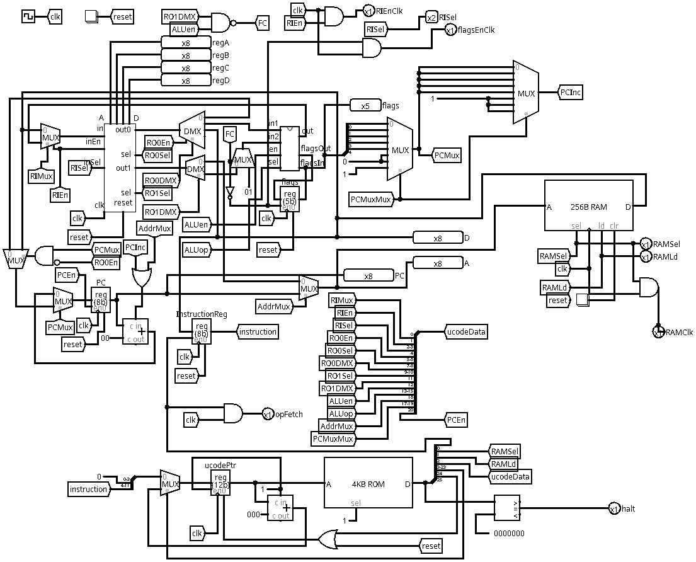
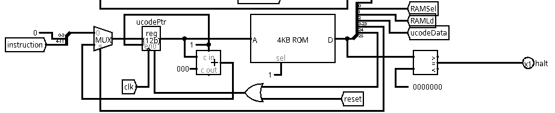

# _{{ page.title }}_

# Main sections of TTP

## The register bank

The register bank (sub-circuit `regBank`) houses four *software addressable* registers. This means these four registers, labeled register A to register D in TTPASM, can be specified explicitly in opcodes. The register bank can update one of the four registers, and connect up to two of the registers to the output of the register bank.

Look into the `regBank` circuit, and understand how it operates. Specifically, figure out the following:

* How to specify a register to update on the next rising edge.
* How to specify which register connects to which output of `regBank`. There are two outputs.

## The `ALU`

The `ALU` (arithmetic and logic unit) is responsible for computations and "logic." Logic, in this case, is merely determining some elementary conditions, such as whether the minuend is less than the subtrahend in a subtraction, or whether the result of an operation is zero.

The `ALU` itself does not provide values to computations, nor does it store the results of computations. In TTP, registers are used to supply data for computations, as well as to store results of computations.

In the circuit of the `ALU`, there are many multiplexers and demultiplexers to route values needed for computations and results from computations. Track down how this routing is specified by the input pins of the `ALU`. Furthermore, track down the outputs of the `ALU`, and backtrack to figure out what each output represents. This is particularly important for the bits related to `flagsIn` and `flagsOut`.

## The controller

The controller is the lower portion in the TTP, centering around the only ROM component. 

The controller is responsible for the coordination of all the other parts of TTP to perform actual operations.

## RAM

Technically, the RAM component is not a part of TTP. In reality, RAM is often outside of the die of a processor because it takes up more spaces. However, the are processor chips that include RAM when the amount of RAM can be combined to the same die.

RAM is used to store/supply opcodes, this is the main idea of a von Neumann architecture. However, RAM is also used to store global variables, as well as the stack.

# Registers that are not software addressable

TTP has a few registers that are not software addressable. This means that these registers cannot be directly accessed by opcodes. 

* `ucodePtr`: the microcode pointer is a register that connects to the ROM component. This register is at the core of controller part of TTP. Of all the registers, `ucodePtr` is the only one that is sensitive to a falling edge instead of a rising edge.
* `PC`: the program counter stores the address in RAM (not ROM) of where to find the *next* opcode.
* `flags`: the flags register stores the carry, zero, overflow, sign, and less-than flags from the ALU from the most recent ALU operation. These flags can, then, be utilized by conditional branch instructions.
* `InstructionReg`: the instruction register temporarily stores a copy of the opcode in RAM that is pointed to by `PC`, which is then used to update `ucodePtr` to "decode" an opcode.

# How to understand operations of TTP

At first glance, TTP looks like a big mess with wires and tunnels everywhere. However, there is a structure method to gain an understanding of how it gets work done.

## The phases of executing an opcode

### Fetch

When `ucodePtr==0` on a rising edge, `InstructionReg=*PC`, and this is called the fetch cycle/phase of executing an opcode. You may want to examine location 0 of the ROM, and see how registers are enabled, how RAM is enabled, and how multiplexers and demultiplexers are configured to accomplish the RTL (register transfer language) description `InstructionReg=*PC`.

*Sort of* part of the fetch cycle, when `ucodePtr==1` on a rising edge, `PC=PC+1` to autoincrement the program counter for the next opcode. Again, it is useful to understand how the D port of ROM controls a multiplexer to specify this behavior.

### Decode

When `ucodePtr==1` on a falling edge, `ucodePtr=InstructionReg << 4`. Track down the circuit to find out how this is accomplished by a splitter, a multiplexer, and the corresponding bits from the D port of ROM.

After decode, `ucodePtr` points to a specific location in ROM. The content at this location of ROM is presented to the D port of ROM.

### Execute

There is no easy way to describe what happens in the execute cycle/phase of executing an opcode because this part depends on the opcode. The ROM allocates 16 microcode slices (locations in ROM) per opcode. However, most opcodes can be accomplished by two microcode slices. Every opcode needs the last microcode slice to reset `ucodePtr` to zero.

To analyze a specific microcode slice of a specific opcode:

* Start with the *active components*. Find out which of the following are in use: `regBank`, `ALU`, `PC`, `RAM`. These components have specific ports that can help indicate whether they are in use or not.
* If a component is active, figure out what it needs as input, and its output. 
  * Then track down the input to find out where it comes from. This often means running into multiplexers and demultiplexers. You will need to examine the select port of each multiplexer/demultiplexer and find out how the component does as a switch.
  * Also track down the output to find how what component utilizes the output. In seldom cases, the output may be ignored and no component uses the output.

In simpler terms, to understand what a microcode slice does, first determine the active components used, then find out how these components are routed to each other.
